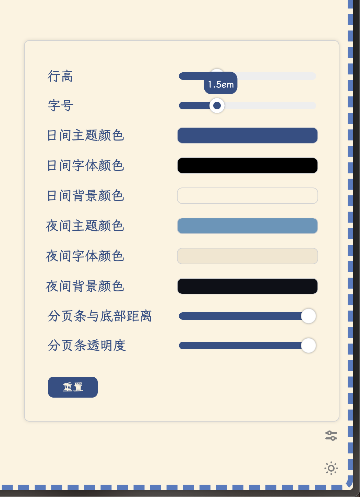
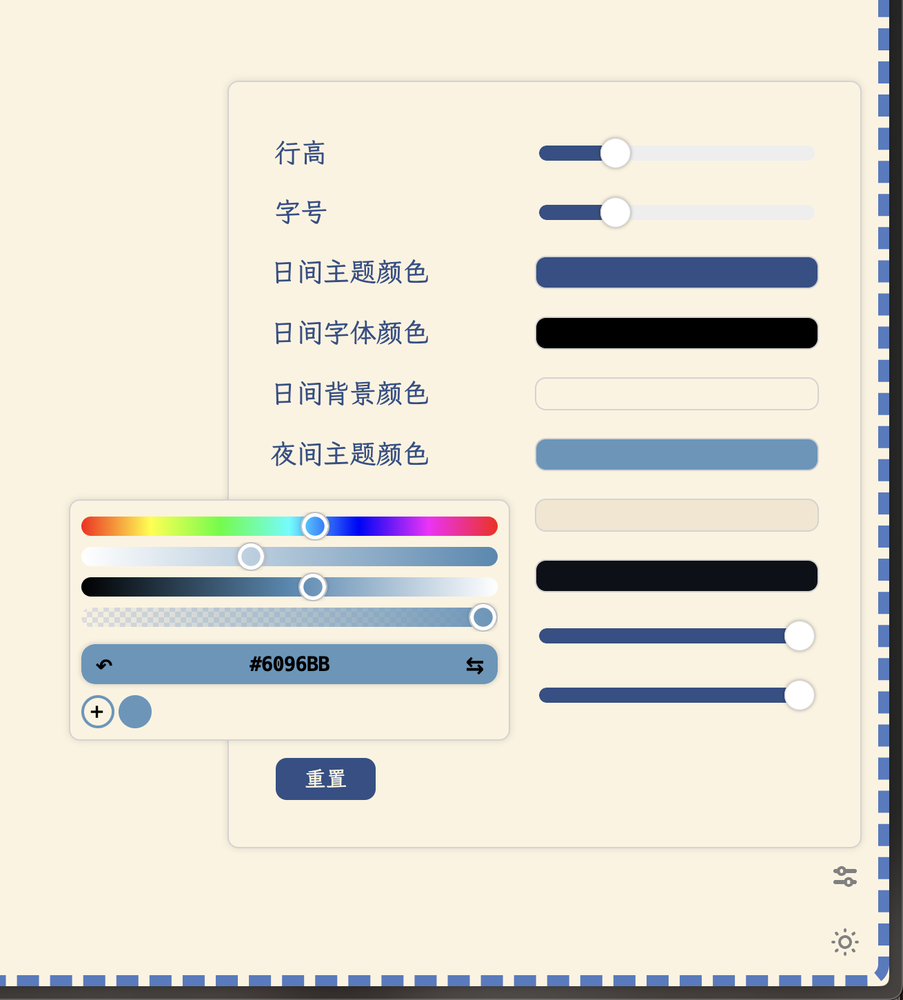
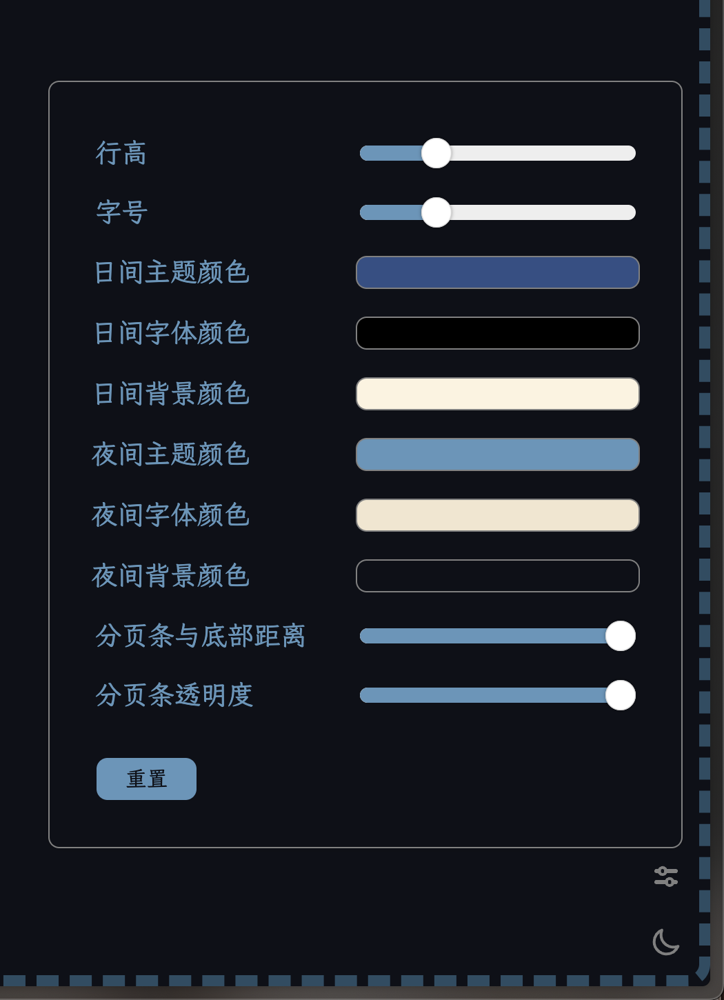
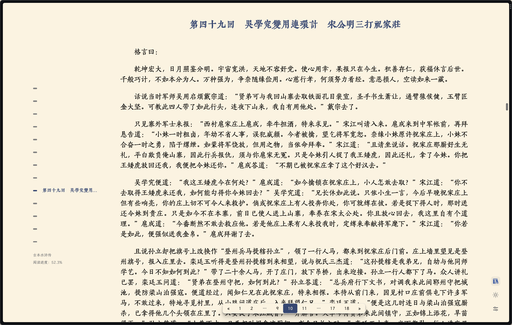

# SimpleTextReader - 易笺

中文 / [English](README_EN.md)

易笺是一款简单纯粹的文本文件阅读器（Web App）。

官网: [https://reader.yijian.app](https://reader.yijian.app)

非常感谢 [Manjusaka](https://github.com/Zheaoli) 大佬帮忙大佬的热心帮助以及帮忙host易笺！鞠躬！

## 特性

1. 百兆文件秒开，支持自动识别文件编码（我在国外系统是英文，打开中文小说简直是痛苦）
2. 中英文小说名、作者名自动识别：

    `《书名》作者：作者名.txt`

    `书名.[作者].txt`

    `Bookname by author.txt`

3. 中英文标题正则自动识别 —— 自信的说，标题抓取几乎很少有超过易笺的了，看官们可以自行和别的阅读器对比
4. 支持自动抓取小说中的脚注（支持的脚注格式可以参考我修改的《逍遥游》[百度网盘｜提取码: qehd](https://pan.baidu.com/s/1p8WAzB8dMWW7WH6Acf3Ulw?pwd=qehd)）
5. 界面语言随着拖进来的文件而改变（中英自动切换，别的语言咱也不会……）
6. 自动去除文字中的一些广告，目前只对塞班和知轩藏书的小说进行了优化
7. 自动制作扉页，显示识别出的标题名和作者名，再戳上一个藏书章（中英文藏书章是不同的哦！）
8. 自动储存阅读进度，精确到每一行！
9. 书架功能，自动生成书籍封面
10. 颜值高，颜值高，颜值高

## 重大更新

### v1.0

易笺上线火狐 / Chrome 插件商店啦！插件一共有两个版本：

1. 正常版：点击插件图标即可召唤完整的易笺界面。将文本文件拖入界面后，即可进行阅读。

2. 无界面版本：无界面版的易笺会检测 URL，任何以 “.txt” 结尾的 URL （包括拖拽进浏览器的本地文件，`file://*.txt`）都会自动在易笺中打开。值得注意的是，无界面版本打开文件的速度会相对较慢，因为浏览器会先加载完整的文件再传给易笺渲染。

### v1.1

易笺可以在任何基于 Chromium 内核的浏览器里安装为 PWA 应用。

### v1.2

支持暗黑模式

### v1.3

    
    
    

支持行高，字体大小，主题颜色等参数的自定义

### v1.4

1. 新增本地缓存书架 —— 特别鸣谢 [cataerogong](https://github.com/cataerogong) 的技术支持！

    [1] 支持同时选择/拖拽多个 txt 文档加入书架；

    [2] 自动生成书籍封面；封面颜色根据用户设置的主题颜色变化；

    [3] 书籍排列顺序：

        a. 阅读中书籍按阅读时间顺序排列

        b. 未读书籍按书籍名称排列

        c. 已读完书籍按阅读时间顺序排列

    [4] 在书架中显示每本书的进度以及其他详细信息；

    [5] 书架高度由书籍数量而定；

    [6] 阅读时点击右下角的书架（或者按 Esc 键）图标返回书架界面。

2. 界面语言默认为浏览器语言 —— 如果浏览器语言中包括中文，界面则用中文；反之则默认英文界面

    [1] 当阅读书籍时界面语言为书籍语言以获得更好的用户体验

3. 其他稳定性更新若干

***注意：书架无法在火狐隐私浏览模式下启动，会被自动禁用。***

    
    
    
    

## 使用

火狐插件：

1. [易笺正常版 (v1.4)](https://addons.mozilla.org/zh-CN/firefox/addon/yijian/)

2. [易笺无界面版 (v1.2.3)](https://addons.mozilla.org/zh-CN/firefox/addon/yijian_nogui/)

Chrome插件：

1. [易笺正常版 (v1.4)](https://chrome.google.com/webstore/detail/%E6%98%93%E7%AC%BA/dbanahlbopbjpgdkecmclbbonhpohcaf?hl=en&authuser=0)

2. [易笺无界面版 (v1.2.3)](https://chrome.google.com/webstore/detail/%E6%98%93%E7%AC%BA%EF%BC%88%E6%97%A0%E7%95%8C%E9%9D%A2%E7%89%88%EF%BC%89/mifnkjlmnnaamfgmhmjdjiplaaladjlo?hl=en&authuser=0)

---

### 本项目仅用于学习交流使用，请勿用于商业用途。
