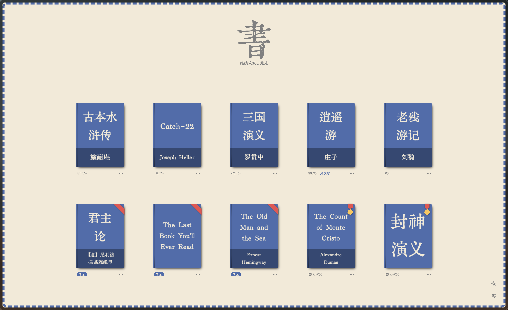
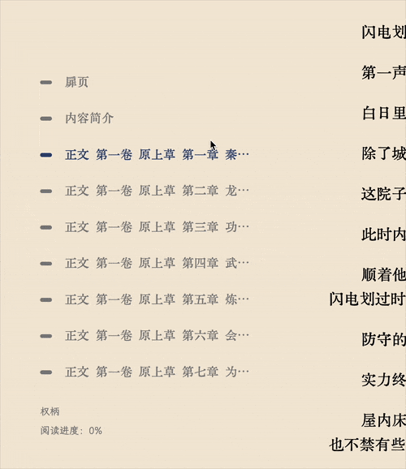
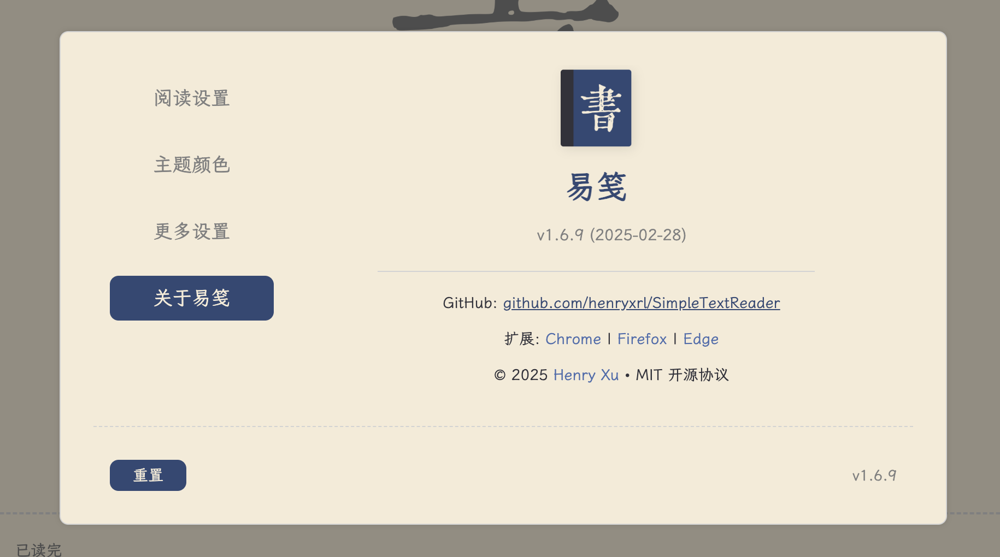
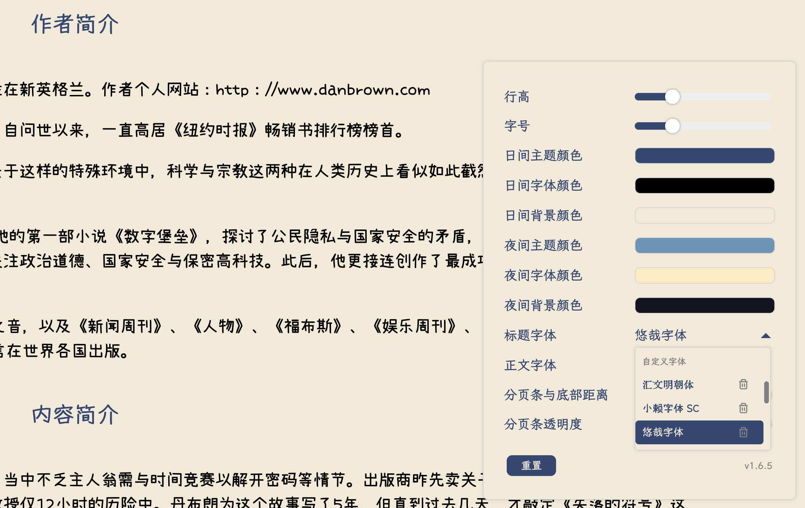
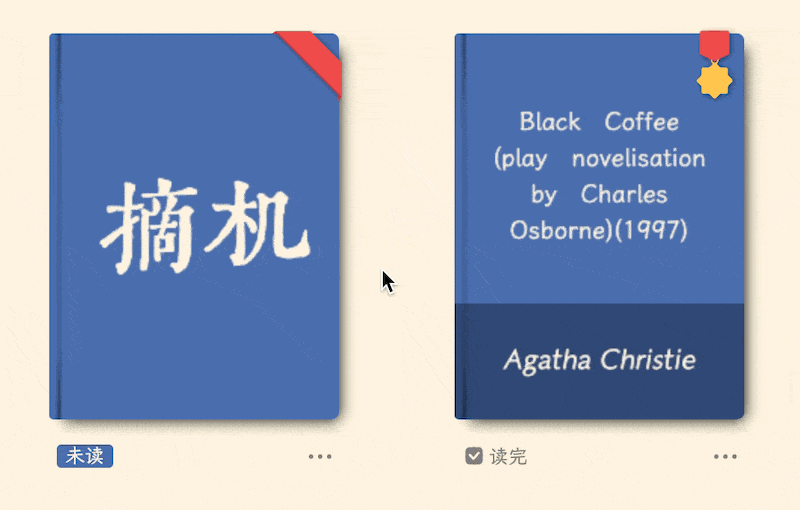

<!-- markdownlint-disable MD033 MD041 -->
<div align="center">

<!-- Project Logo -->
<a href="https://reader.yijian.app" target="_blank">
    
</a>

<br>

<!-- Project Badges -->

<!-- MIT License -->
<a href="https://opensource.org/licenses/MIT" target="_blank">
    
</a>

<!-- Chrome Users -->
<a href="https://chrome.google.com/webstore/detail/dbanahlbopbjpgdkecmclbbonhpohcaf" target="_blank">
    
</a>

<!-- Firefox Users -->
<a href="https://addons.mozilla.org/zh-CN/firefox/addon/yijian/" target="_blank">
    
</a>

<!-- Edge Users -->
<a href="https://microsoftedge.microsoft.com/addons/detail/pabihehbdhldbdliffaddllmjlknmpak" target="_blank">
    
</a>

<!-- Docker Pulls -->
<a href="https://hub.docker.com/r/henryxrl/simpletextreader" target="_blank">
    
</a>

<br/><br/>

<!-- Project README's -->
<a href="README.md">中文</a> | <a href="README_EN.md">English</a>

</div>

易笺是一款简单纯粹的 TXT 阅读器，让朴素的纯文本书籍拥有精致优雅的阅读体验。



官网: [https://reader.yijian.app](https://reader.yijian.app)

测试: [https://beta.yijian.app](https://beta.yijian.app)

非常感谢 [CataeroGong](https://github.com/cataerogong) 大佬的热心帮助以及 [Manjusaka](https://github.com/Zheaoli) 大佬帮忙托管易笺！鞠躬！

## 特性

1. 百兆文件秒开，支持自动识别文件编码（我在国外系统是英文，打开中文小说简直是痛苦）

2. 中英文小说名、作者名自动识别：

    `《书名》作者：作者名.txt`

    `书名.[作者].txt`

    `Bookname by author.txt`

3. 中英文标题正则自动识别 —— 自信的说，标题抓取几乎很少有超过易笺的了，看官们可以自行和别的阅读器对比

    - 在 TXT 文件中，在任意行的行首添加 `[::]` 标记，可手动指定该行为标题行

4. 支持自动抓取小说中的脚注（详见 [使用脚注](#2使用脚注)）

5. 界面语言随着拖进来的文件而改变（中英自动切换，别的语言咱也不会……）

6. 自动去除文字中的一些广告，目前只对塞班和知轩藏书的小说进行了优化

7. 自动制作扉页，显示识别出的标题名和作者名，再戳上一个藏书章（中英文藏书章是不同的哦！）

8. 自动储存阅读进度，精确到每一行！

9. 书架功能，自动生成书籍封面

10. 可添加最多 3 种自定义字体（支持 TTF 或 OTF 格式）

11. 支持十二款网络字体（需联网使用）：黄令东齐伋复刻体、上图东观体、全瀨體、匯文明朝體、匯文仿宋、匯文正楷、仓耳与墨、仓耳渔阳体、屏显臻宋、霞鹜新晰黑、寒蝉半圆体、寒蝉正楷体

12. 颜值高，颜值高，颜值高

## 使用

### 1. **添加书籍**

- 将 **TXT 格式的书籍**拖入界面，可一次性导入多本书籍

- 也可双击界面，手动选择书籍文件进行添加

### 2. **添加字体**

- 支持**最多 3 个字体文件**（TTF 或 OTF），可直接拖入界面进行导入

- 也可双击界面，手动选择字体文件进行添加

### 3. **书架管理**

- 点击书籍封面可打开相应书籍

- 按住 **Alt/Option 键**点击书籍封面，可**强制重新处理**该书籍

- 使用书架顶部的**筛选栏**进行书籍筛选

- 删除书籍：

  - 在筛选栏中**删除所有书籍**

  - 也可**单独删除**书籍（将鼠标移至书籍封面，即可看到删除图标）

### 4. **阅读功能**

- 点击**左侧目录**可跳转至指定章节

- 使用键盘**左右方向键**进行前后翻页（或在设置菜单中开启无限滚动模式）

- 使用键盘 **Page Up / Page Down 键**跳转至上一章节或下一章节

- 使用 **Esc 键** 返回书架

### 5. **进阶使用（修改 TXT 源文件）**

#### （1）手动标记标题

- 在任意行的行首添加 **`[::]`** 标记，可手动指定该行为**标题行**

- 示例：

    ```txt
    [::] 写在故事的最后
    ```

#### （2）使用脚注

- 在文本中插入 **① 到 ㊿** 以**引用脚注**。每个段落都可以从 **①** 开始重新编号

- 脚注内容行需使用**对应的数字符号**开头

- 示例：

    ```txt
    北冥①有鱼，其名为鲲②。鲲之大，不知其几③千里也④；化而为鸟，其名为鹏⑤。
    ①北冥：北海，因海水深黑而得名。冥，通“溟”，指广阔幽深的大海。
    ②鲲（kūn）：本义鱼子，小鱼。在此被庄子借用为大鱼之义。
    ③几：本义为极微小，引申为“极为接近”。
    ④千里也：应有千里之大。
    ⑤鹏：传说中的大鸟。
    ```

- 参考示例：《逍遥游》[百度网盘｜提取码: qehd](https://pan.baidu.com/s/1p8WAzB8dMWW7WH6Acf3Ulw?pwd=qehd)

## 下载

**注：如果需要直接访问拖入浏览器中的本地 txt 文件（`file://*.txt`）（相当于以前的无界面模式），需要在扩展管理界面中打开`允许访问文件 URL`**

### Chrome 插件

- [易笺 (v1.6.9.4)](https://chrome.google.com/webstore/detail/%E6%98%93%E7%AC%BA/dbanahlbopbjpgdkecmclbbonhpohcaf)

### 火狐插件

- [易笺 (v1.6.9.4)](https://addons.mozilla.org/zh-CN/firefox/addon/yijian/)

### Edge 插件

- [易笺 (v1.6.9.4)](https://microsoftedge.microsoft.com/addons/detail/pabihehbdhldbdliffaddllmjlknmpak)

### Docker

```bash
# 基础运行命令
docker run -d --name simpletextreader \
-p 8866:8866 \
--restart unless-stopped \
henryxrl/simpletextreader:latest

# 带图书库目录的运行命令（实验性功能 - 可能存在 bug）
docker run -d --name simpletextreader \
-p 8866:8866 \
-v /path/to/your/books:/app/books \
--restart unless-stopped \
henryxrl/simpletextreader:latest
```

## URL 参数（调试用）

使用 URL 参数时，在 URL 末尾添加 `?param`。若要同时使用多个参数，请添加 `?param1&param2&param3`。请确保不要在参数前添加斜杠 (`/`)。

1. `no-bookshelf`：禁用书架功能

2. `no-settings`：禁用设置菜单

3. `no-fast-open`：禁用快速打开书籍功能，书籍会在处理完成后才会打开

4. `no-pagebreak-on-title`：禁用按章节分页，退回到根据行数分页的模式

5. `always-process`：强制在打开书籍时重新处理，忽略已保存的处理结果

6. `print-db`：打印当前保存书籍的数据库

7. `upgrade-db`：手动升级或清理当前数据库

## 重大更新

### v1.6

1. 代码全面重构，提升整体性能和可维护性

2. 性能显著提升

    [1] 大文件打开速度显著提升，做到 1 秒以内（可以通过在 URL 末尾添加 `?no-fast-open` 参数来关闭此功能）

    [2] 文件在首次处理后，下次打开无需再次处理，加载速度更快（可以通过在 URL 末尾添加 `?always-process` 参数来关闭此功能）

    - 如果需要手动强制重新处理一本书，请按住 **Alt** 键并点击（Windows/Linux）或按住 **Option** 键并点击（Mac）该书。这与添加 `?always-process` 参数的效果相同，但仅对单本书生效。

    [3] 界面无任何卡顿现象

3. 全新的章节标题提取逻辑

    - 除了使用预定义的正则表达式外，v1.6.4 增加了自动从文档中识别标题规律的功能，大幅提升了标题提取的准确率。

    - v1.6.9.2 中新增了在源 TXT 文件中手动标记标题的功能（详见 [手动标记标题](#1手动标记标题)）。

4. 全新的分页逻辑

    - 快捷键：

        - **← → 方向键** 翻页，或在设置中开启 **无限滚动模式**（v1.6.9.2 中新增）

        - **Page Up / Page Down 键** 跳转至上或下一章节（v1.6.9.2 中新增）

5. 全新的目录显示：当鼠标指针位于目录区域外时，仅显示当前章节的简化名称，对中英文小说均有效。例如，`正文 第一卷 原上草 第一章 秦少爷初临宝地 防狼术小试牛刀` 将简化为 `秦少爷初临宝地 防狼术小试牛刀`。当鼠标移入目录区域时，会显示完整的章节名称。

   

6. 新增主界面功能栏，包含以下功能：

    - 按阅读状态分类书籍

    - 显示书籍数量统计

    - 删除所有书籍功能，包含确认提示以防止误操作

7. 全新的设置菜单

    

8. 支持添加自定义字体（v1.6.6），最多可添加 3 个字体

    <div float="left">
        
        
    </div>

9. 支持网络字体（需联网使用，v1.6.9.4）。目前支持以下字体：

    - 黄令东齐伋复刻体

    - 全瀨體

    - 上图东观体

    - 屏显臻宋

    - 霞鹜新晰黑

    - 寒蝉正楷体

10. 新增消息通知系统

11. 新增“快读完”的阅读进度提示

12. 优化书籍封面生成逻辑

13. 更流畅的界面语言切换

14. 改用京华老宋体作为默认字体，以规避可能的版权问题

15. 支持浏览器历史导航

16. 修复若干 Bug，提升了稳定性和用户体验

**注：从 v1.6 开始，不再支持无界面（No-UI）版本。无界面版本中的所有功能（包括通过 `file://*.txt` URL 打开本地 `.txt` 文件）现已完全集成到正常版本中。**

### v1.5

1. 支持设置书籍的标题字体和正文字体

2. 移除了检测章节标题的字符限制

3. 优化英文章节标题的正则

4. 更优雅的目录

5. 重写分页逻辑。如需用回老版本分页逻辑，请在 URL 最后加上`?no-pagebreak-on-title`参数。

6. 上架 Edge 插件商店

### v1.4

1. 新增本地缓存书架 —— 特别鸣谢 [cataerogong](https://github.com/cataerogong) 的技术支持！

    [1] 支持同时选择/拖拽多个 txt 文档加入书架；

    [2] 自动生成书籍封面；封面颜色根据用户设置的主题颜色变化；

    [3] 书籍排列顺序：

    ```text
        a. 阅读中书籍按阅读时间顺序排列

        b. 未读书籍按书籍名称排列

        c. 已读完书籍按阅读时间顺序排列
    ```

    [4] 在书架中显示每本书的进度以及其他详细信息；增加未读和读完书籍封面的样式；

    

    [5] 书架高度由书籍数量而定；

    [6] 阅读时点击右下角的书架（或者按 Esc 键）图标返回书架界面。

    [7] 如需取消书架，请在 URL 最后加上`?no-bookshelf`参数。

2. 界面语言默认为浏览器语言 —— 如果浏览器语言中包括中文，界面则用中文；反之则默认英文界面

    [1] 当阅读书籍时界面语言为书籍语言以获得更好的用户体验

3. 针对超宽屏优化

4. 其他稳定性更新若干

**_注意：书架无法在隐私浏览模式下启动，会被自动禁用。_**

<div float="left">
    
    
    
    
</div>

### v1.3

支持行高，字体大小，主题颜色等参数的自定义

<div float="left">
    
    
    
</div>

如需取消设置界面，请在 URL 最后加上`?no-settings`参数

### v1.2

支持暗黑模式


### v1.1

易笺可以在任何基于 Chromium 内核的浏览器里安装为 PWA 应用

### v1.0

易笺上线火狐 / Chrome 插件商店啦！插件一共有两个版本：

1. 正常版：点击插件图标即可召唤完整的易笺界面。将文本文件拖入界面后，即可进行阅读。

2. 无界面版本：无界面版的易笺会检测 URL，<s>任何以 “.txt” 结尾的 URL （包括拖拽进浏览器的本地文件，`file://*.txt`）都会自动在易笺中打开。</s>值得注意的是，无界面版本打开文件的速度会相对较慢，因为浏览器会先加载完整的文件再传给易笺渲染。

**注：自 v1.2.6 开始，无界面版本只会打开本地 txt 文件，即 `file://*.txt`。**

---

### 本项目仅用于学习交流使用，请勿用于商业用途
