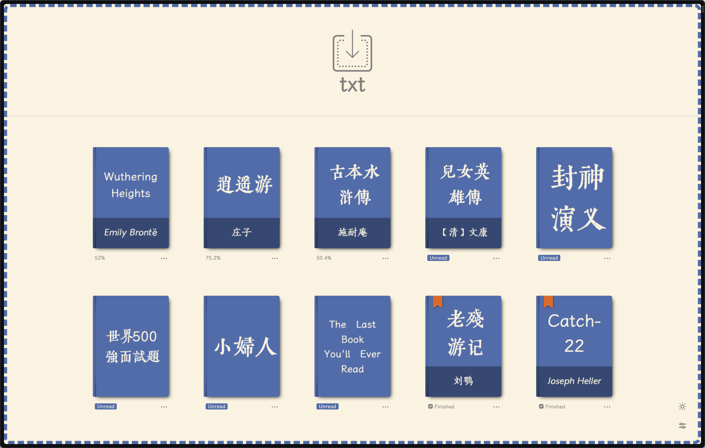
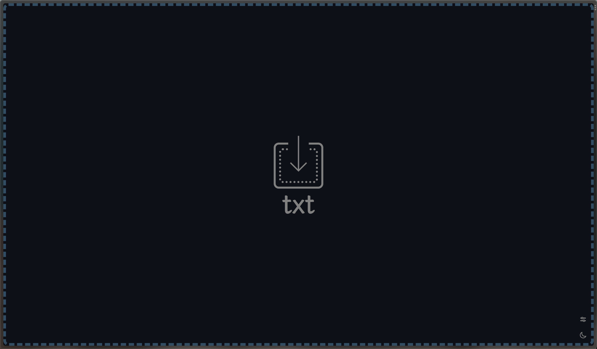
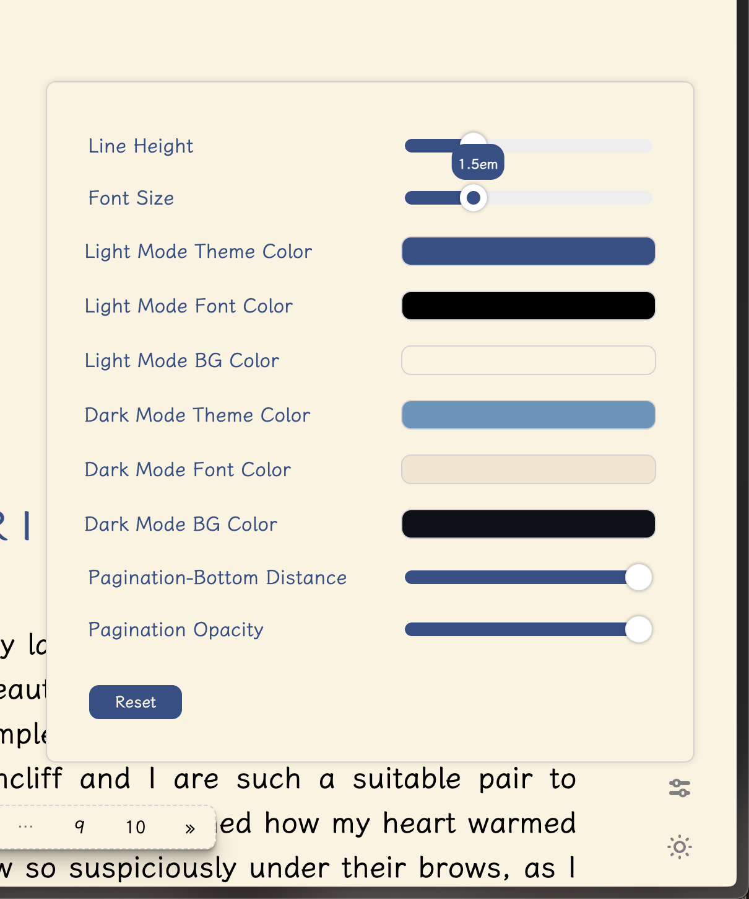
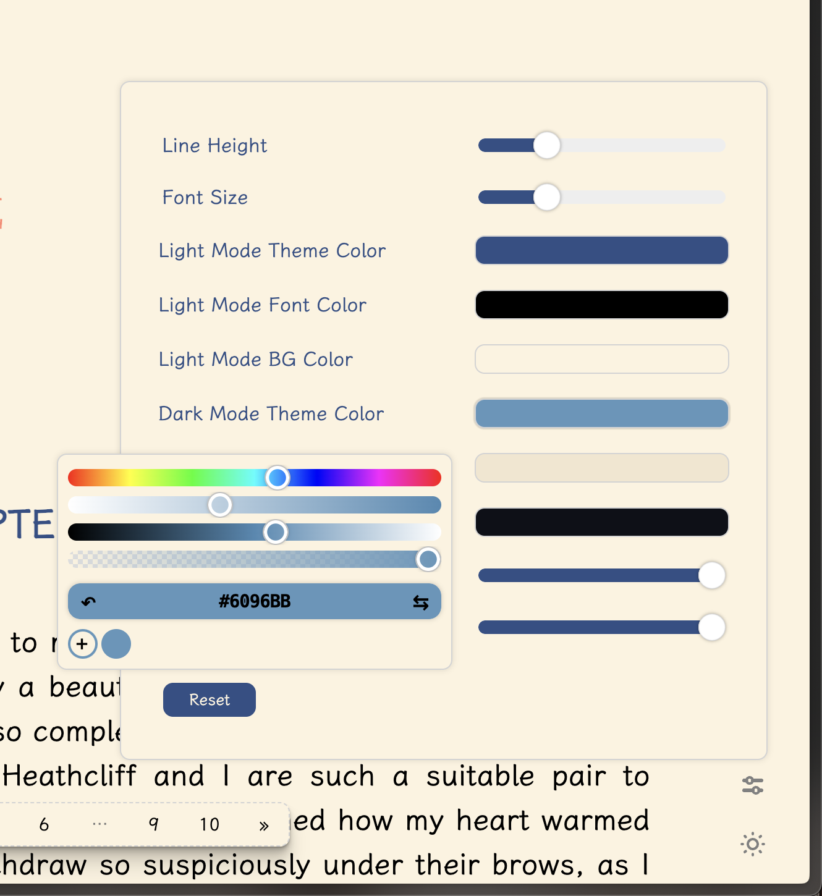
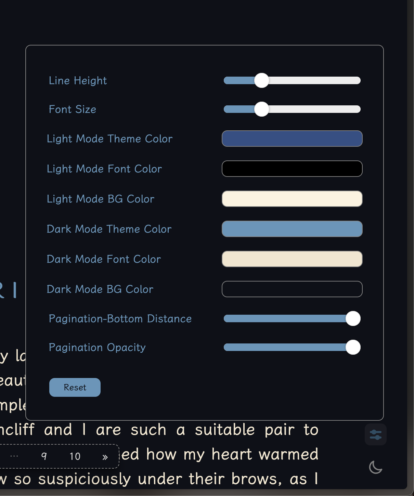
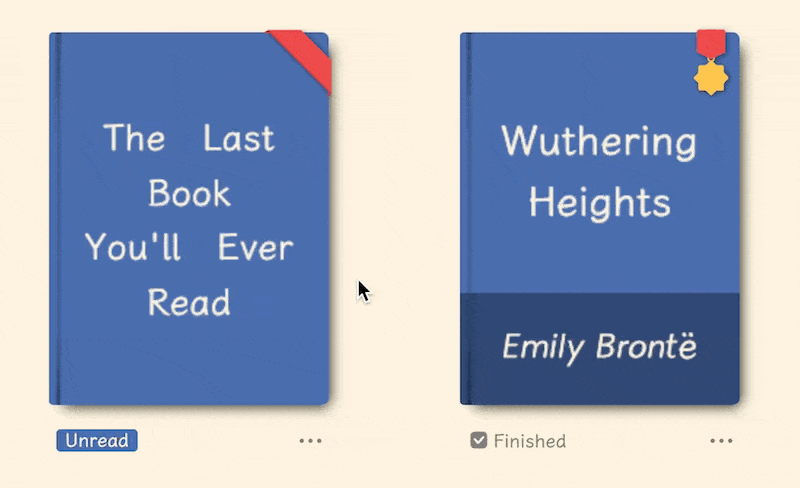
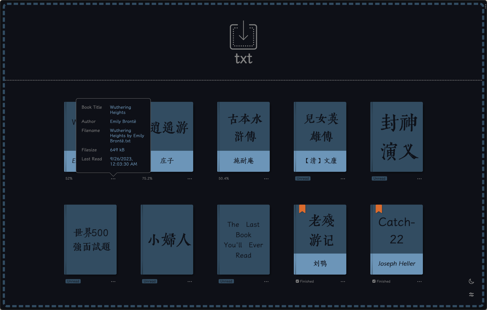
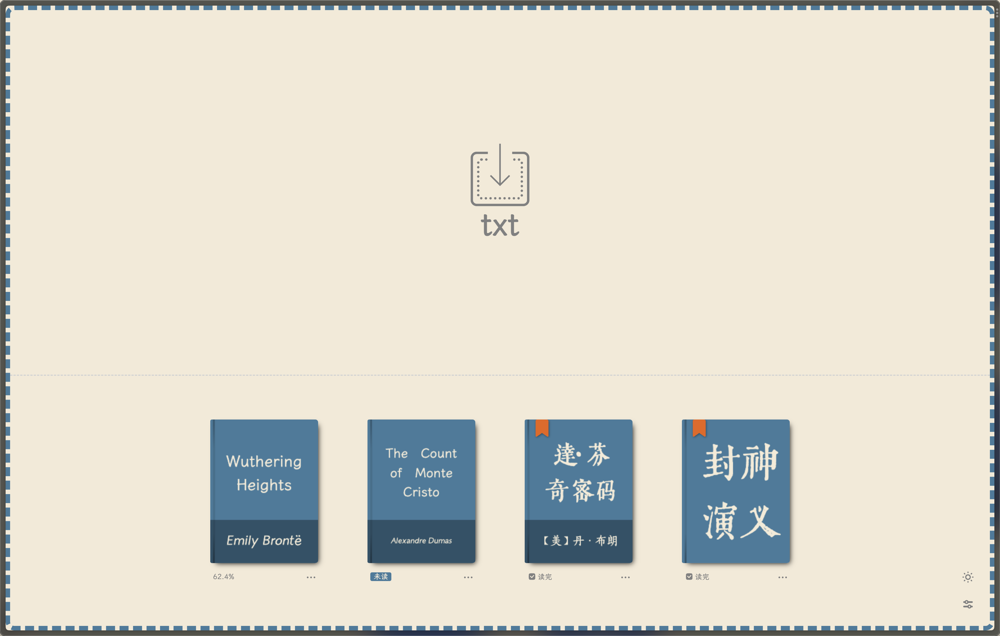
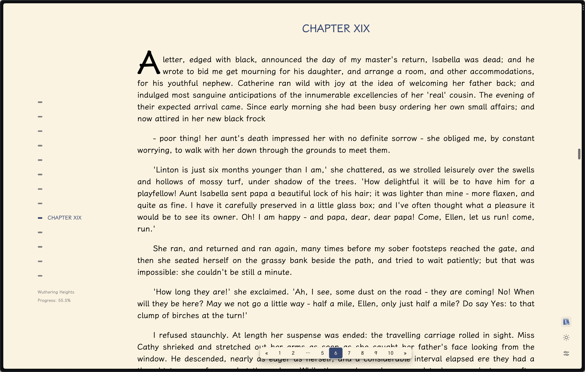

 
<h1>SimpleTextReader - 易笺</h1>

 
<a href="README.md">中文</a> | English
  

SimpleTextReader is the online text reader that simulates the result of SimpleEpub2, providing a web-based reading experience.

Official site: [https://reader.yijian.app](https://reader.yijian.app)

Big thanks to [Manjusaka](https://github.com/Zheaoli) for his amazing help and hosting 易笺! Really appreciate it!

## Highlights

1. Open large text files in a split second; automatic detection of text encoding
2. Auto detection of file name:

    `《书名》作者：作者名.txt`

    `书名.[作者].txt`

    `Bookname by author.txt`

3. Auto detection of chapter titles using Regular Expressions
4. Auto styling of footnotes
5. UI language depends on the text file opened in SimpleTextReader (English vs. Chinese)
6. Auto detection and removal of text ads in the file
7. Auto generation of book seal stamps for fun
8. Auto save reading process
9. Auto generation of book cover arts in the bookshelf
10. Modern-looking UI design

## Important Updates

### v1.0

Now SimpleTextReader is also available as a Chrome/Firefox extension with two distinct versions:

1. Regular version: Upon clicking the icon from the extension list, the full UI appears, providing the same functionality as the complete SimpleTextReader web app.

2. No-UI version: Once activated, <s>any URL ending in ".txt" (including local text files that were dragged and dropped in the browser, `file://*.txt`) will be automatically opened using SimpleTextReader.</s> However, please be aware that this version might have slower performance when opening large text files. The delay is due to the browser's default behavior of loading the entire file at once, which cannot be modified.

    **NOTE: Starting from v1.2.6, No-UI version only opens local txt files, i.e., `file://*.txt`.**

### v1.1

Now SimpleTextReader can be installed as a PWA in supported browsers (Chromium-based browsers such as Chrome and Edge).

### v1.2

Enable dark mode.

### v1.3

    
    
    

Support for customized settings such as font size, line height, theme colors and much more.

### v1.4

1. Enable local bookshelf. Special thanks to [cataerogong](https://github.com/cataerogong) for their coding support and contributions!

    [1] Now you can easily add multiple text files to the bookshelf by selecting or drag-and-dropping;

    [2] Auto generation of book cover arts based on the user's chosen colors;

    [3] Books are sorted as the following:

        a. dIn-progress books: sorted by last opened time;

        b. Unread books: sort by file names;

        c. Finished books: sort by last opened time.

    [4] Show reading progress and other detailed information for each book; add special stylings of book covers for both unread books and finished books;

    

    [5] The height of the bookshelf automatically adjusts according to the number of books;

    [6] In reading mode, click on the bookshelf icon in the bottom-right corner (or press the `Esc` key) to return to the bookshelf.

2. Improve the user interface language setting, which now automatically adapts to the browser's language preferences. If your browser languages include Chinese, the UI language will be set to Chinese; otherwise, it will default to English.

    [1] When reading, the UI language is set to match the language of the book for better reading experience.

3. Other stability bug fixes.

***NOTE: The bookshelf feature is incompatible with Firefox's private browsing mode and will be automatically deactivated.***

    
    
    
    

## Usage

### Download from online stores

Firefox:

1. [Regular (v1.4.6)](https://addons.mozilla.org/en-US/firefox/addon/yijian/)

2. [No-UI (v1.2.6)](https://addons.mozilla.org/en-US/firefox/addon/yijian_nogui/)

Chrome:

1. [Regular (v1.4.6)](https://chrome.google.com/webstore/detail/%E6%98%93%E7%AC%BA/dbanahlbopbjpgdkecmclbbonhpohcaf?hl=en&authuser=0)

2. [No-UI (v1.2.6)](https://chrome.google.com/webstore/detail/%E6%98%93%E7%AC%BA%EF%BC%88%E6%97%A0%E7%95%8C%E9%9D%A2%E7%89%88%EF%BC%89/mifnkjlmnnaamfgmhmjdjiplaaladjlo?hl=en&authuser=0)

---

### This project is only for personal use and for learning purpose, not for commercial use.
