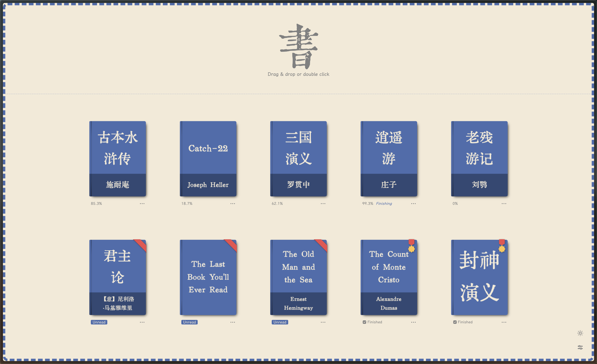
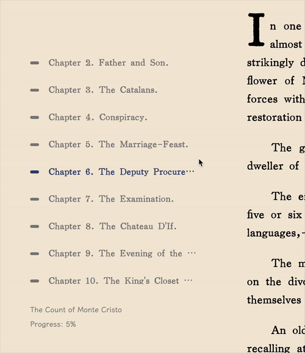
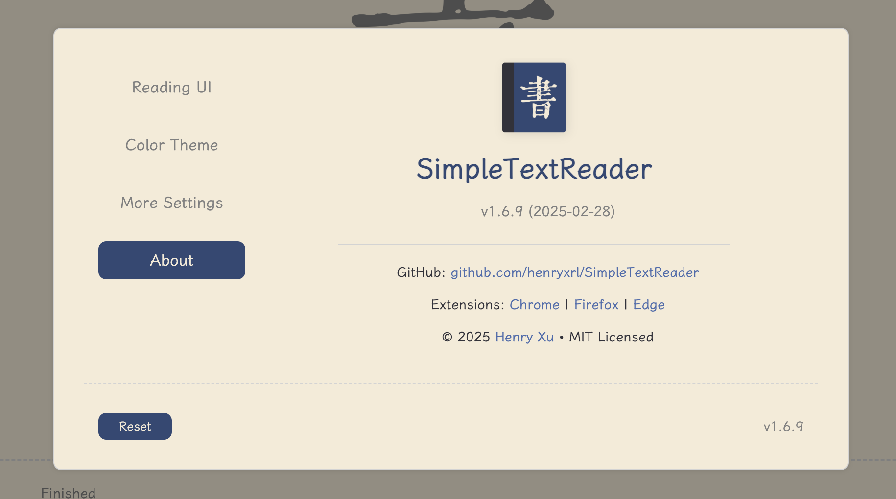
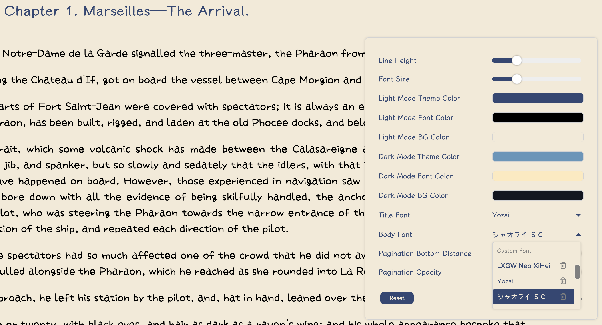

<!-- markdownlint-disable MD033 MD041 -->
<div align="center">

<!-- Project Logo -->
<a href="https://reader.yijian.app" target="_blank">
    
</a>

<br/>

<!-- Project Badges -->

<!-- MIT License -->
<a href="https://opensource.org/licenses/MIT" target="_blank">
    
</a>

<!-- Chrome Users -->
<a href="https://chrome.google.com/webstore/detail/dbanahlbopbjpgdkecmclbbonhpohcaf" target="_blank">
    
</a>

<!-- Firefox Users -->
<a href="https://addons.mozilla.org/en-US/firefox/addon/yijian/" target="_blank">
    
</a>

<!-- Edge Users -->
<a href="https://microsoftedge.microsoft.com/addons/detail/pabihehbdhldbdliffaddllmjlknmpak" target="_blank">
    
</a>

<!-- Docker Pulls -->
<a href="https://hub.docker.com/r/henryxrl/simpletextreader" target="_blank">
    
</a>

<br/><br/>

<!-- Project README's -->
<a href="README.md">中文</a> | <a href="README_EN.md">English</a>

</div>

SimpleTextReader enhances plain TXT reading with a refined, elegant experience.



Official site: [https://reader.yijian.app](https://reader.yijian.app)

Beta site: [https://beta.yijian.app](https://beta.yijian.app)

Big thanks to [CataeroGong](https://github.com/cataerogong) for his amazing help and [Manjusaka](https://github.com/Zheaoli) for hosting SimpleTextReader! Really appreciate it!

## Highlights

1. Instant opening of large text files with automatic text encoding detection

2. Auto detection of file name:

    `《书名》作者：作者名.txt`

    `书名.[作者].txt`

    `Bookname by author.txt`

3. Auto detection of chapter titles using Regular Expressions

4. Auto styling of footnotes

5. UI language depends on the text file opened in SimpleTextReader (English vs. Chinese)

6. Auto detection and removal of text ads in the file

7. Auto generation of book seal stamps for fun

8. Auto save reading process

9. Auto generation of book cover arts in the bookshelf

10. Support for up to 3 custom fonts (TTF or OTF formats)

11. Sleek, modern UI design

## Usage

**Note: To view the local text files (`file://*.txt`) directly dragged into the browser (no-ui mode), please enable "Allow access to file URLs" in the extension management page.**

### Chrome

- [SimpleTextReader (v1.6.9.1)](https://chrome.google.com/webstore/detail/%E6%98%93%E7%AC%BA/dbanahlbopbjpgdkecmclbbonhpohcaf)

### Firefox

- [SimpleTextReader (v1.6.9.1)](https://addons.mozilla.org/en-US/firefox/addon/yijian/)

### Edge

- [SimpleTextReader (v1.6.9.1)](https://microsoftedge.microsoft.com/addons/detail/pabihehbdhldbdliffaddllmjlknmpak)

### Docker

```bash
# Basic Docker run command
docker run -d --name simpletextreader \
  -p 8866:8866 \
  --restart unless-stopped \
  henryxrl/simpletextreader:latest

# Run the container with a library directory (experimental - prone to bugs)
docker run -d --name simpletextreader \
  -p 8866:8866 \
  -v /path/to/your/books:/app/books \
  --restart unless-stopped \
  henryxrl/simpletextreader:latest
```

### URL Parameters (For debug purposes)

To use URL parameters, append `?param` to the end of the URL. To use multiple parameters simultaneously, append `?param1&param2&param3`. Ensure you do not add a slash (`/`) before the parameters.

1. `no-bookshelf`: Disables the bookshelf feature.

2. `no-settings`: Disables the settings menu.

3. `no-fast-open`: Disables fast book opening. This means the book will only open after the entire processing is complete.

4. `no-pagebreak-on-title`: Disables page breaks on chapter titles, reverting to the previous mode where page breaks depend solely on the number of lines.

5. `always-process`: Forces the book to reprocess upon opening, ignoring any previously saved processed book.

6. `print-db`: Prints the current database(s) of saved books. [For debugging purposes]

7. `upgrade-db`: Upgrades or cleans the current database(s) manually. [For debugging purposes]

## Important Updates

### v1.6

1. Complete code rewritting to improve overall performance and maintainability.

2. Significant Performance Improvements:

    [1] Large files now open significantly faster, with near-instant response times (less than 1 second). This feature can be turned of by adding `?no-fast-open` option at the end of the URL.

    [2] Previously processed files can be reopened without processing, further reducing loading time. This feature can be turned of by adding `?always-process` option at the end of the URL.

    - To manually force reprocess a book, hold **Alt** and click (Windows/Linux) or **Option** and click (Mac) on the book. This achieves the same effect as adding the `?always-process` option but applies to a single book only.

    [3] Interface operations are smooth and free from lag.

3. Enhanced chapter title detection logic.

    - In addition to predefined regular expressions, v1.6.4 introduces the ability to automatically detect title patterns from the text file and dynamically add them to the regex rule library, significantly improving the accuracy of title extraction.

4. New pagination logic.

5. New table of contents display: When the cursor is outside the table of contents area, only the simplified chapter title is displayed, applicable to both Chinese and English novels. For example, `Chapter 6. The Deputy Procureur du Roi.` will be simplified to `The Deputy Procureur du Roi.`. When the cursor moves back into the table of contents area, the full chapter title will be displayed.

   

6. Added a toolbar in the main interface with features including:

    - Categorizing books by reading status

    - Displaying book count statistics

    - Providing a "remove all books" button with a confirmation prompt to prevent accidental actions

7. New settings menu interface.

    

8. Support for adding custom fonts (v1.6.6), with a limit of up to 3 fonts.

    <div float="left">
        
        
    </div>

9. Added a notification system.

10. "Finishing up" reading progress indicator.

11. Optimized book cover generation.

12. Smoother UI language switching.

13. Updated default font to "Kinghwa Old Song" to avoid potential copyright issues.

14. Support for browser history navigation.

15. Resolved various minor bugs, enhancing stability and user experience.

**NOTE: Starting from v1.6, the No-UI version has been discontinued. All features previously available in the No-UI version, including support for opening local `.txt` files via `file://*.txt` URLs, are now fully integrated into the Regular version.**

### v1.5

1. Support customizing fonts for book title and body.

2. Removed the character limitation for detecting chapter titles.

3. Better Regex for English chapter titles.

4. Optimized the table of contents section.

5. Rewrite pagination logic. To disable it, add `?no-pagebreak-on-title` option at the end of the URL.

6. Edge extension

### v1.4

1. Enable local bookshelf. Special thanks to [cataerogong](https://github.com/cataerogong) for their coding support and contributions!

    [1] Now you can easily add multiple text files to the bookshelf by selecting or drag-and-dropping;

    [2] Auto generation of book cover arts based on the user's chosen colors;

    [3] Books are sorted as the following:

    ```text
        a. In-progress books: sorted by last opened time;

        b. Unread books: sort by file names;

        c. Finished books: sort by last opened time.
    ```

    [4] Show reading progress and other detailed information for each book; add special stylings of book covers for both unread books and finished books;

    

    [5] The height of the bookshelf automatically adjusts according to the number of books;

    [6] In reading mode, click on the bookshelf icon in the bottom-right corner (or press the `Esc` key) to return to the bookshelf.

    [7] To disable the bookshelf, add `?no-bookshelf` option at the end of the URL.

2. Improve the user interface language setting, which now automatically adapts to the browser's language preferences. If your browser languages include Chinese, the UI language will be set to Chinese; otherwise, it will default to English.

    [1] When reading, the UI language is set to match the language of the book for better reading experience.

3. Optimized for ultrawide monitors.

4. Other stability bug fixes.

**_NOTE: The bookshelf feature is incompatible with browsers' private/incognito mode and will be automatically deactivated._**

<div float="left">
    
    
    
    
</div>

### v1.3

Support for customized settings such as font size, line height, theme colors and much more.

<div float="left">
    
    
    
</div>

To disable the settings menu, add `?no-settings` option at the end of the URL.

### v1.2

Enable dark mode.


### v1.1

Now SimpleTextReader can be installed as a PWA in supported browsers (Chromium-based browsers such as Chrome and Edge).

### v1.0

Now SimpleTextReader is also available as a Chrome/Firefox extension with two distinct versions:

1. Regular version: Upon clicking the icon from the extension list, the full UI appears, providing the same functionality as the complete SimpleTextReader web app.

2. No-UI version: Once activated, <s>any URL ending in ".txt" (including local text files that were dragged and dropped in the browser, `file://*.txt`) will be automatically opened using SimpleTextReader.</s> However, please be aware that this version might have slower performance when opening large text files. The delay is due to the browser's default behavior of loading the entire file at once, which cannot be modified.

**NOTE: Starting from v1.2.6, No-UI version only opens local txt files, i.e., `file://*.txt`.**

---

### This project is only for personal use and for learning purpose, not for commercial use
